# fluidmechanics-sem3

## Seminarium 3 — Utvärdering av laboration 1 (del 1)

**Grupp B2**

---

### Fråga 1: Tryckkoefficienten $c_p$

Tryckkoefficienten beräknas enligt

$$c_p = \frac{h - h_\infty}{h_0 - h_\infty}$$

där $h$ är manometerhöjden vid tryckhålet, $h_\infty$ är friströmsreferensen och $h_0$ är stagnationsreferensen. Beräkningen görs för samtliga 13 anfallsvinklar ($\alpha = 0°, 3°, 6°, 9°, 12°, 14°, 16°, 18°, 19°, 20°, 21°, 16°, 13°$). Den lägsta uppmätta tryckkoefficienten är $c_p = -3.36$, vid $x/c = 0.027$ på översidan vid $\alpha = 14°$.

#### (a) Största värdet på $c_p$

Det största värde som $c_p$ kan anta är **$c_p = 1$**. Detta inträffar vid **stagnationspunkten**, där strömningshastigheten är noll ($u = 0$).

Från Bernoullis ekvation: vid stagnation gäller $p = p_0 = p_\infty + \tfrac{1}{2}\rho U_\infty^2$, vilket ger

$$c_p = \frac{p_0 - p_\infty}{\tfrac{1}{2}\rho U_\infty^2} = 1$$

Från våra mätningar fås det maximala värdet $c_p = 1.01$ vid nosen ($x/c = 0$) vid $\alpha = 0°$, vilket stämmer väl. Vid noll anfallsvinkel ligger stagnationspunkten precis vid näsan. När anfallsvinkeln ökar flyttas stagnationspunkten till undersidan av profilen, och $c_p$ vid nosen sjunker under 1.

#### (b) Härledd med Bernoullis ekvation: $1 - c_p = (u/U_\infty)^2$

Vi tillämpar Bernoullis ekvation längs en strömlinje från friströmmen till en punkt på vingytan:

$$p_\infty + \tfrac{1}{2}\rho U_\infty^2 = p + \tfrac{1}{2}\rho u^2$$

Löser ut tryckskillnaden:

$$p - p_\infty = \tfrac{1}{2}\rho\left(U_\infty^2 - u^2\right)$$

Dividerar med det dynamiska trycket $\tfrac{1}{2}\rho U_\infty^2$:

$$c_p = \frac{p - p_\infty}{\tfrac{1}{2}\rho U_\infty^2} = \frac{U_\infty^2 - u^2}{U_\infty^2} = 1 - \left(\frac{u}{U_\infty}\right)^2$$

Omskrivet:

$$\boxed{1 - c_p = \left(\frac{u}{U_\infty}\right)^2}$$

Storheten $1 - c_p$ representerar alltså kvadraten på den lokala hastighetskvoten. Där $1 - c_p > 1$ är den lokala hastigheten större än friströmshastigheten, och vid stagnation ($u = 0$) gäller $1 - c_p = 0$.

#### (c) Plottar av $1 - c_p$ som funktion av $x/c$

Samtliga plottar finns i mappen `figures/`. Nedan visas en sammanställning av alla anfallsvinklar:

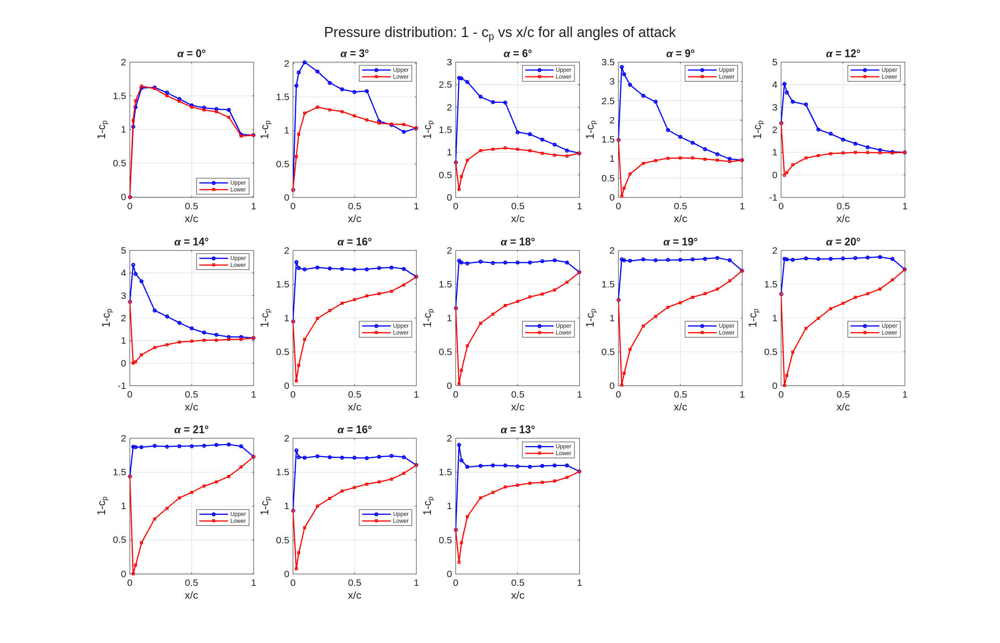

Individuella plottar:

| Anfallsvinkel | Figur |
|---|---|
| $\alpha = 0°$ | 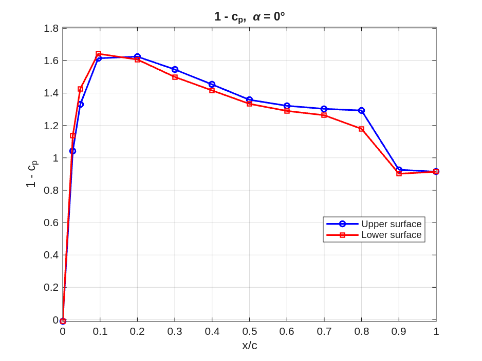 |
| $\alpha = 3°$ | 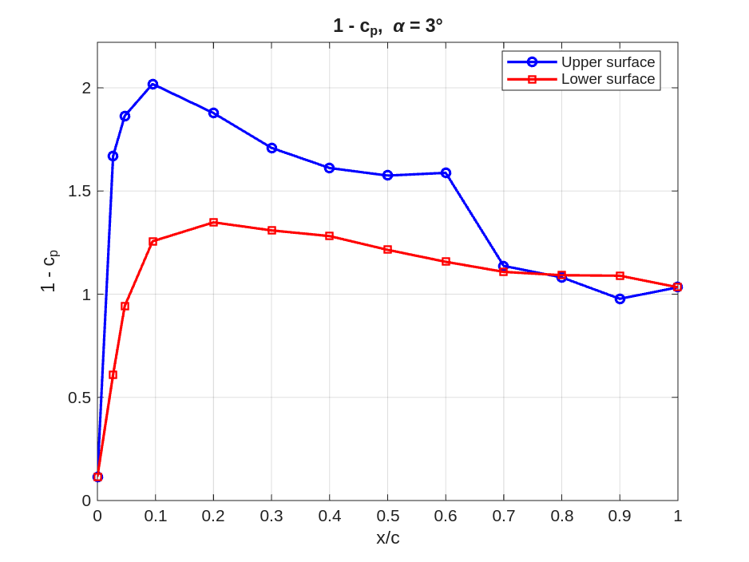 |
| $\alpha = 6°$ | 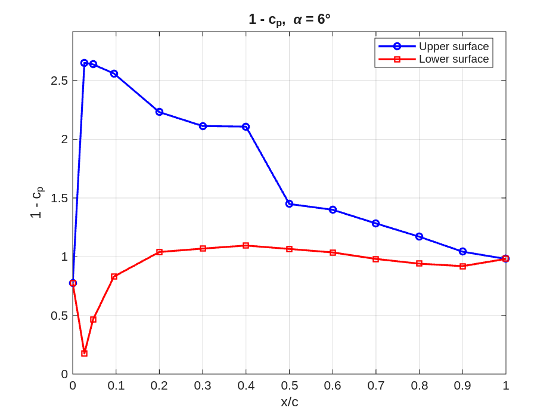 |
| $\alpha = 9°$ | 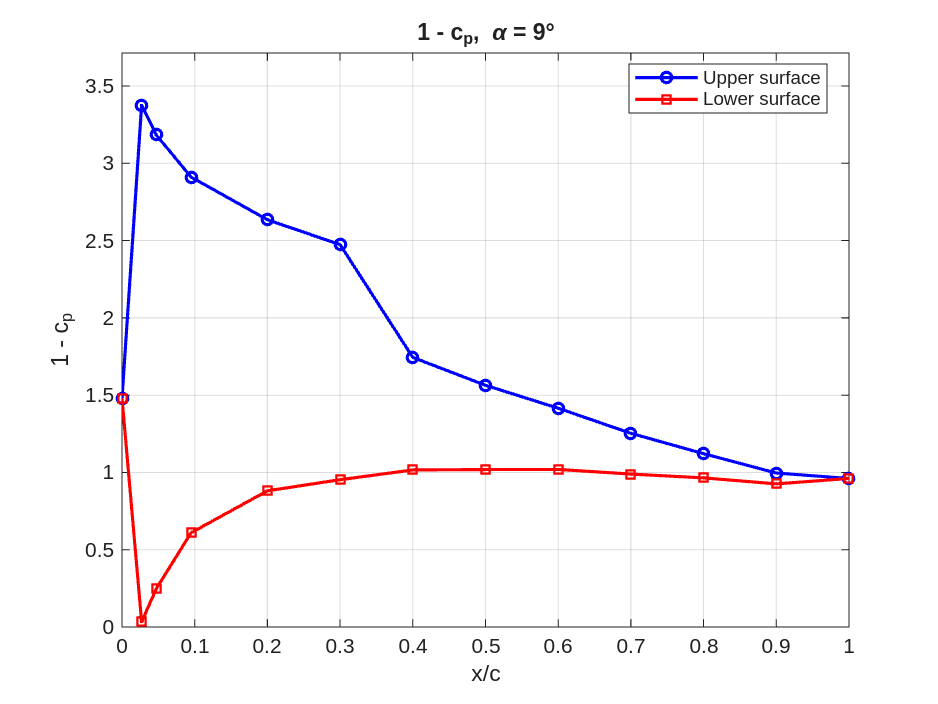 |
| $\alpha = 12°$ | 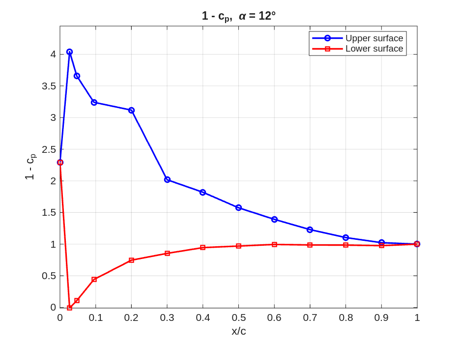 |
| $\alpha = 14°$ | 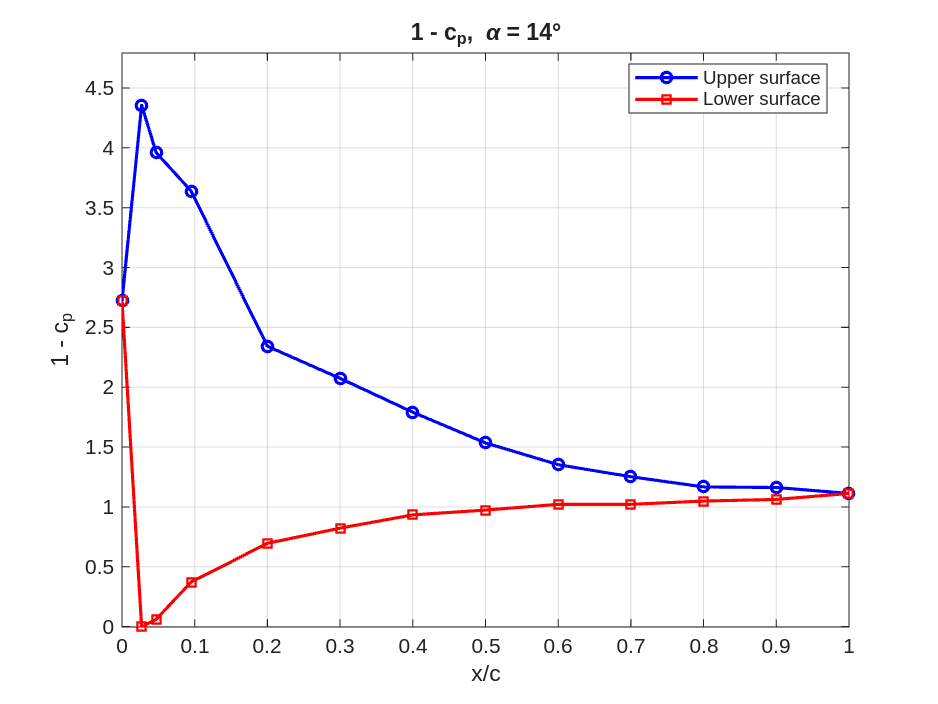 |
| $\alpha = 16°$ | 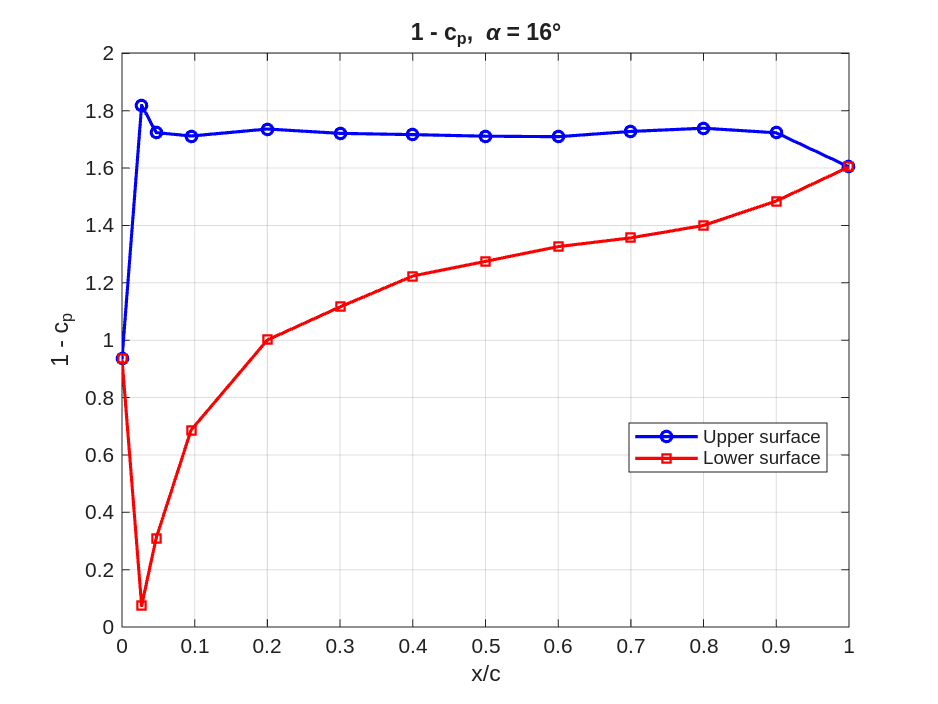 |
| $\alpha = 18°$ | 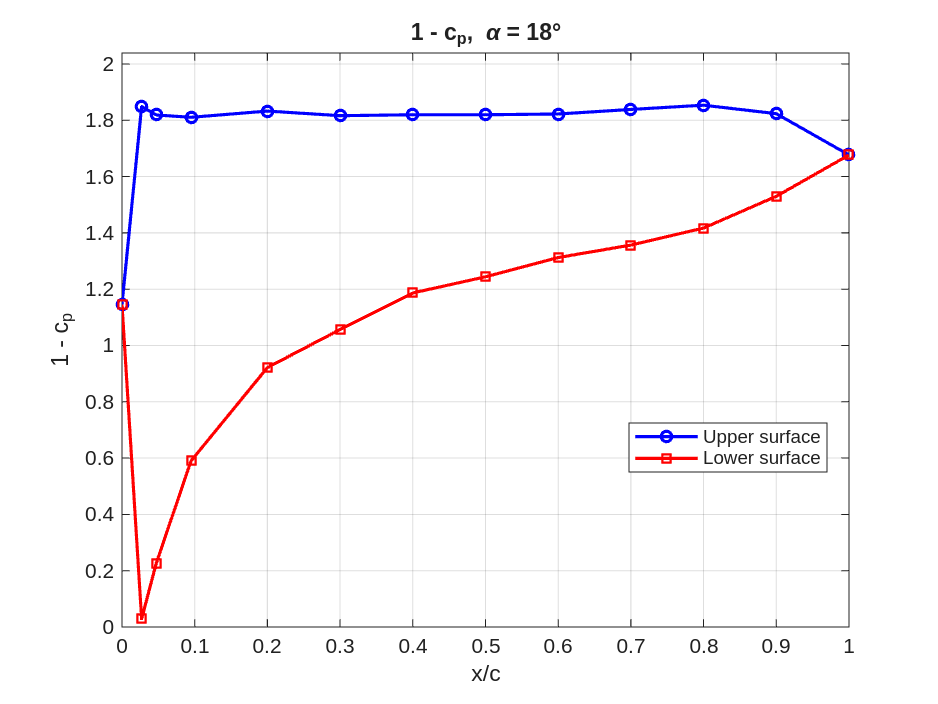 |
| $\alpha = 19°$ | 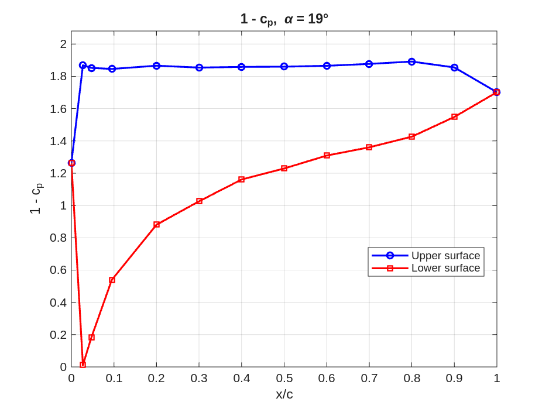 |
| $\alpha = 20°$ | 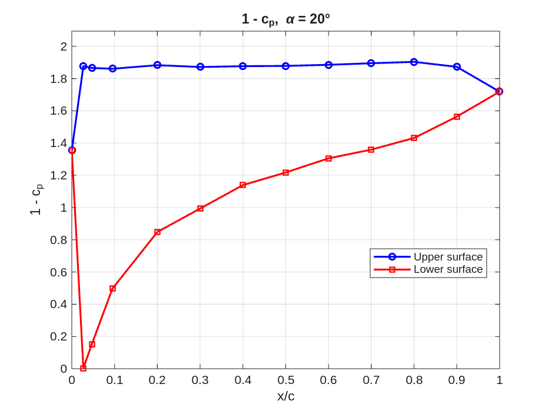 |
| $\alpha = 21°$ | 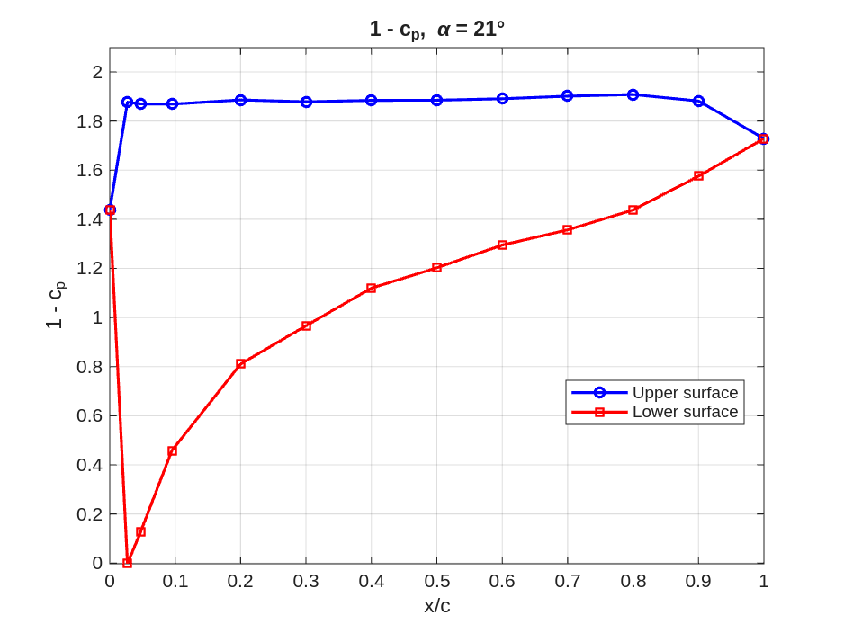 |
| $\alpha = 13°$ | 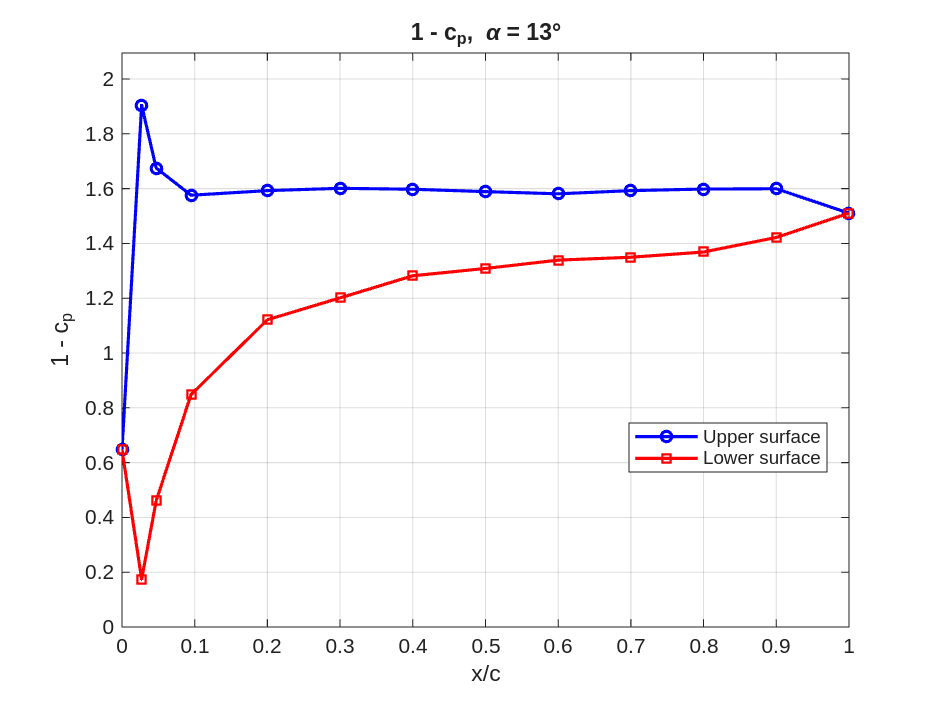 |

#### (d) Analys av tryckfördelningens beteende

Tryckfördelningen genomgår tre tydliga regimer då anfallsvinkeln ökar:

**1. Liten anfallsvinkel ($\alpha = 0°$–$3°$): Symmetrisk/svagt asymmetrisk fördelning**

Vid $\alpha = 0°$ är profilen symmetrisk och uppvisar (nästan) identiska tryckfördelningar på över- och undersida. Strömningen accelererar från stagnationspunkten vid nosen ($1 - c_p \approx 0$) till en hastighetstopp runt $x/c \approx 0.1$–$0.2$ ($1 - c_p \approx 1.6$, dvs. $u \approx 1.3\,U_\infty$), för att sedan retarderas mot bakkanten. Vid $\alpha = 3°$ börjar kurvorna separera: översidan visar högre $1 - c_p$ (mer sug) och undersidan lägre, vilket ger en nettolyftkraft uppåt.

**2. Måttlig anfallsvinkel ($\alpha = 6°$–$14°$): Växande sugtopp**

När $\alpha$ ökar växer sugtoppen på översidan kraftigt nära framkanten. Vid $\alpha = 14°$ når $1 - c_p \approx 4.4$ vid $x/c = 0.027$, dvs. den lokala hastigheten är $u \approx 2.1\,U_\infty$. Samtidigt minskar $1 - c_p$ på undersidan nära framkanten mot noll, vilket betyder att stagnationspunkten har flyttats från nosen till undersidan. Den stora skillnaden i tryck mellan över- och undersida ger en stark lyftkraft. Tryckfördelningen på översidan visar en gradvis retardation från den starka sugtoppen mot bakkanten — strömningen är fortfarande anlutande (attached).

**3. Stall ($\alpha \geq 16°$): Avlösning**

Vid $\alpha = 16°$ sker en dramatisk förändring: sugtoppen på översidan kollapsar helt. Istället för en hög, skarp sugtopp visar översidan en nästan konstant $1 - c_p \approx 1.5$–$1.7$ längs hela kordan. Detta innebär att strömningen har lösgjort sig (separerat) från översidan nära framkanten — profilen har stallat. Det plötsliga trycket på översidan blir nästintill uniformt, vilket kraftigt reducerar lyftkraften. Undersidan visar ökande $1 - c_p$ mot bakkanten, vilket tyder på acceleration runt undersidan.

Beteendet kvarstår och förvärras vid $\alpha = 18°$–$21°$: översidan förblir separerad med uniformt låg sug. Jämförs de två mätningarna vid $\alpha = 16°$ (en tidig och en sen) syns god repeterbarhet, vilket bekräftar att mätningarna är konsekventa.

| $\alpha$ | $\min(c_p)$ översida | Beteende |
|---|---|---|
| 0° | −0.63 | Symmetrisk, anlutande strömning |
| 6° | −1.65 | Växande sugtopp, anlutande |
| 12° | −3.04 | Stark sugtopp, anlutande |
| 14° | −3.36 | Maximal sug, precis före stall |
| 16° | −0.83 | Stallad — sugtoppen har kollapsat |
| 21° | −0.91 | Fullständig avlösning |
